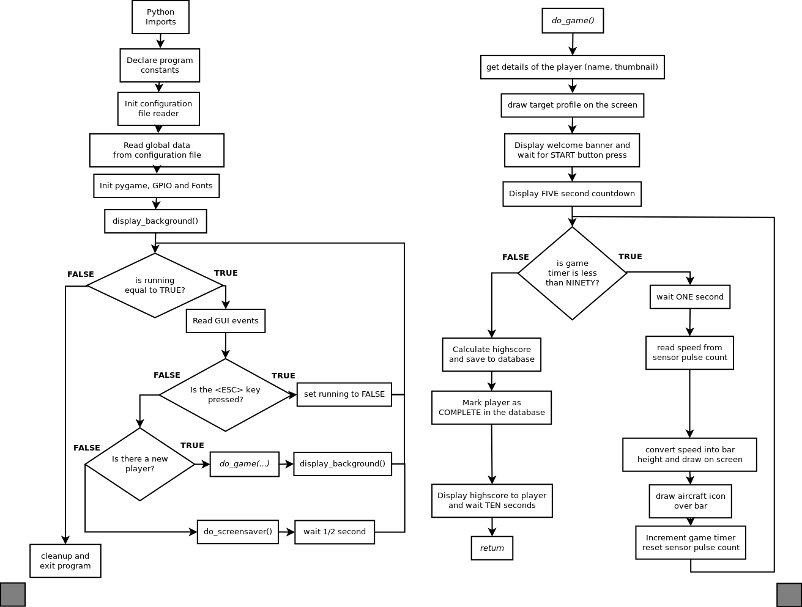

# Application Overview
The Digital Engine Simulator application is controlled primarily via the Scoreboard application

# Launching the Application
The following steps are to be carried out on the Raspberry Pi.
To launch the Digital Engine Simulator application, simply double-click the Launch Pi.sh icon on the Desktop.  When prompted click on “Execute”.
If this does not work correctly, then you can launch the application from the command prompt by typing:- 
> cd ~/des_digitalenginesimulator  
> sudo python digitalenginesimulator.py digitalenginesimulator.cfg    
> Note: sudo is required as root access is needed to access the GPIO 

# Application Operation
The application will wait until a player is selected for play by the Dashboard application.  Once a player has been selected for play the target profile is drawn, the player name and avatar image is displayed and the player is prompted to press the START button on the handlebars to continue.  A five second countdown is displayed, then the game starts.  The player must peddle the cycle for 90 seconds trying to match the target profile shown, their actual profile is drawn along with an aircraft icon.  At the end of the 90 seconds the game ends and their score is displayed for 10 seconds.  The game then return to idle mode waiting for the next player.  The ESC key can be used to exit the application when it is waiting for the next player.

# Software Design
The design for the software is shown in the flow diagram below, the code is written entirely in python as a single application

# Technology Stack
Python 2.7.12 
GPIO python library 
pygame python library 1.91 
MySQLlib python library 1.37 

# Going further
1. Implementation using classes? 
2. Animated banners and removal of temporary avatar files? 
3. Dynamic display of actual revolutions in real time? 
4. Guage to tell the player whether to peddle faster or slower? 
