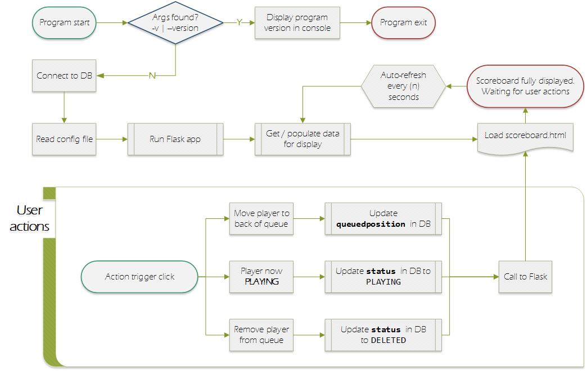
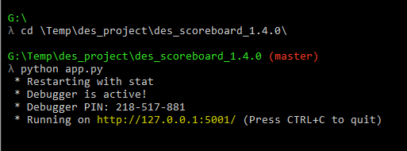

### Digital Engine Simulator
# SCOREBOARD
---
The scoreboard program controls the queue, profile and high-scores web interface for the digital engine simulator.

Included in the scoreboard display are:
+ the name and avatar of the player who is currently playing the game
+ a list of queued players waiting to play the game
+ a top ($n$) list of high-scores
+ a PNG image showing the game's target profile overlaid with the most recent player's cycled profile; allowing the player to see how they did

The player's actual profile image is stored by the `profiler` program in its directory structure and can be made available to the player upon request.


## QUEUE MANAGEMENT CONTROLS
---
Queue management controls are built into the queue table, enabling a game administrator to:
+ set a player's status to PLAYING
+ move a queued player to the back of the queue
+ remove a queued player from the queue

### Setting a player's status
This control is used to activeate a player on the bike and make them ready for game play.  To change a player's status from **QUEUED** to <span style="color: #00afd5;"><b>PLAYING</b></span>, click the **QUEUED** label.  *Ideally* this will be the player at the top of the queue table.

### Moving a player to the back of the queue
If a player in the queue table is not available for play, they can be moved to the back of the queue so the next player can play the game. To move a player to the back of the queue list, click the player's name.

### Remove a player from the queue
If a player is no longer available, or no longer wants to participate, click the player's avatar image and click `YES` to the confirmation prompt to remove them from the queue.

**Note:** the player's record **is not deleted** from the database, but rather, their status is updated to DELETED.


## DESIGN
---
The flow diagram below illustrates the program's design and logic.
<br>



## START THE PROGRAM
---
Follow the steps below to start the scoreboard:

1) Start the program by entering these commands into the CLI:
```bash
$ cd /program/directory
$ python app.py
```
   + When  the program starts, observe the host IP and port number <span style="background-color: black; color: yellow;"> &nbsp; highlighted in yellow&nbsp; </span>, as these will be used in the browser to view the scoreboard.



2) Open your internet browser - Firefox by design
   + In the address bar, enter the IP and port number as observed in the step above

3) <span style="color: #777;">OPTIONAL:</span> run your browser in full-screen mode by pressing `F11`
